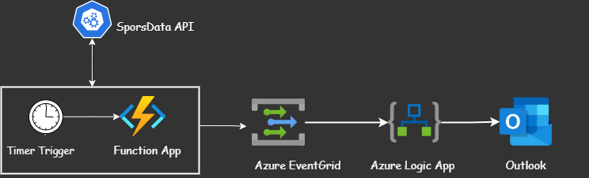

# 30 Days DevOps Challenge - Weather Dashboard
Day 2: Building a Game data notification system using Azure Function App, SendGrid and SportsData.io API

# Game Data Notificaion System - DevOps Day 2 Challenge



## Project Overview
This project automates fetching sports updates from a sports API, processes the data, and sends email notifications to emails using Azure services.

WeatherDashboard is a Python application that fetches weather data for specified cities using the OpenWeather API and stores the data in Azure Blob Storage for further analysis or use. This project demonstrates core DevOps principles by combining:

- External API Integration (OpenWeather API)
- Cloud Storage (Azure Blob storage)
- Infrastructure as Code
- Version Control (Git)
- Python Development
- Error Handling
- Environment Management

## Features
- Fetches real-time weather data from the OpenWeather API
- Stores weather data in Azure Blob Storage in JSON format
- Automatically creates the necessary Azure Blob container if it doesn't exist
- Includes timestamped data for tracking changes over time
- Supports multiple cities tracking

## Prerequisites
- Python 3.x
- Azure Storage Account credentials
- OpenWeather API key

## Dependencies
- python-dotenv
- requests
- azure-storage-blob

## Project Structure
```shell
01_weather_dashboard/g
├── src/
│   ├── __init__.py
│   └── weather_dashboard.py
├── tests/
├── data/
├── .gitignore
├── .env
├── requirements.txt
└── README.md
```
